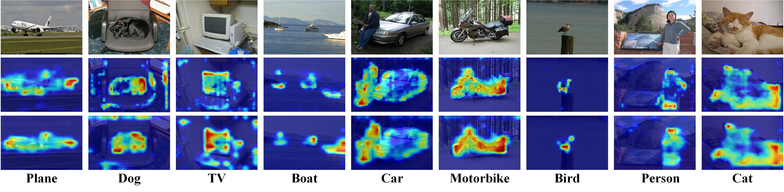

**Figure 1：Effectiveness of Geometric-Aware Prototype.** The second row in the figure represents the prototype clustering method used in the EUMS, while the third row illustrates the use of geometric-aware prototypes for constructing hypergraphs to facilitate novel class inference. As shown in the figure, the geometric-aware prototypes more effectively capture the contours and local structures of target objects. This enables the model to better focus on foreground objects, enhancing its ability to distinguish them from the background.

